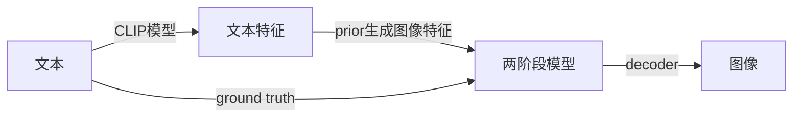

# DALLE2笔记
<iframe src="//player.bilibili.com/player.html?aid=770625648&bvid=BV17r4y1u77B&cid=766807720&page=1" scrolling="no" border="0" frameborder="no" framespacing="0" allowfullscreen="true"> </iframe>
## Abstract

基于扩散模型的解码器能够通过给定信息的解码器，生成很多不一样的图片 ，语义信息和风格比较接近，只是细节不一样。

可以直接修改和编辑模型，是zero-shot的，不需要重新训练。

整体上Dalle2都是一个扩散模型
## Introduction

扩散模型是一种概率分布模型，生成图片是从一个分布中采样，多样性很高，保真度比不过GAN。20年之后有一系列模型改进了这一点。这一系列工作采用了很多技巧，其中一个比较著名的是引导guideance technique，能够牺牲一部分多样性来达到更好的保真度。

上半部分说的是CLIP，下半部分是DALLE2。

CLIP模型中文本和图像分别通过一个文本编码器和一个图像编码器，得到一个文本特征和一个图像特征。对应的文本特征和图像特征之间就是正样本，不对应的就是负样本。通过这种方式来做对比学习，把文本编码器和图像编码器都学的很好，文本和图像的特征就真的联系在了一起。CLIP模型训练好了之后，文本编码器和图像编码器就锁住了，在Dalle2中就不会再训练了。

两阶段训练方式最暴力的方式其实是中间有个大模型，中间去学一些融合的特征，直接生成就可以了。但如何像作者在摘要所说的，中间有一个显式的生成过程，先从文本生成文本特征，再生成图像特征再由图像特征生成图片效果就会好很多。

训练的时候，先用已有图像(CLIP模型中的图片)生成的图像特征作为ground truth去监督，也就是用文本特征来预测ground truth这个图像特征。推理的时候由文本特征就可以直接生成类似CLIP生成的图像特征。

## 图像生成
### GAN

训练两个网络，一个是生成器，一个是判别器。生成器的目标是生成一个和真实图片尽可能相似的图片，判别器的目标是判断一个图片是真实的还是生成的。两个网络相互竞争，最终生成器生成的图片和真实图片的分布越来越接近。

有一个缺点就是训练不够稳定，因为需要同时训练两个网络。此外多样性比较差。
### auto-encoder

给定一个输入x，过一个编码器，然后就能得到一个特征z(特征维度一般会小很多，所以管他叫bottleneck)，再过一个解码器，得到一个图像。训练时的目标函数就是尽可能重建原来输入x

### denoising auto-encoder

先把原图进行一定的打乱，然后把扰乱之后的特征传给编码器，后续和auto-encoder一样。训练时的目标函数还是尽可能重建原来输入x

### varitional auto-encoder

中间不在是学习一个特征，而是去学习了一个分布。作者假设了中间是一个高斯分布，就可以用均值和方差来表示。具体来说就是得到编码器出来的特征之后，在后面加一些fc层，预测一个均值和方差，得到对应的均值和方差之后，我们用公式$z=u+\sigma\epsilon$采样一个z出来,然后给解码器。

预测的时候，我们可以把编码器去掉，直接用均值和方差来预测。

从数学角度讲，这个模型是一个概率模型，给定x得到z这一过程就是一个后验概率，学出来的distribution就是一个先验分布，给定z预测x就是likelihood,这里做的就是maximum likelihood。

图像多样性好得多

### VQVAE(vector quantised VAE)

将VAE做量化。之前的VAE不好把图片做大，分类也不是很好学，所以取而代之的是不做分布的预测，而是以codebook代替。cookbook可以理解成聚类的中心，cookbook大小一般是$K*D$,$K$的大小一般是8192，$D$的大小一般是512或者768，意思是由8912个长度为D的向量。

输入x先经过一个编码器，得到一个特征图大小为$h*w$,将特征图里的向量和cookbook里的特征做对比，看和哪个聚类中心最接近，然后把聚类中心的编码存到矩阵Z中，用矩阵z作为新的特征。

优化起来相对容易。

想做生成的话，就需要再训练一个prior网络.论文作者训练了一个pixelCNN，用来生成图片。

### VQVAE2

模型变成了层级式的，加入了全局式的建模，加上了attention，表达能力增强。把pixelCNN换成了GPT.

### DALL-E

文本先通过BPE编码，得到一个256维特征。还有一个图像，256*256,经过一个VQ-VAE(来自训练好的cookbook，直接拿过来用),得到图像特征32*32,维度下降了很多，一共有1024个token，将文本特征和图像特征连接起来，变成了一个1028的序列，将序列给GPT，训练GPT。

推理则是提供一个文本，得到文本特征，用GPT从文本特征徐策图片特征，用自回归的方式生成图片。生成出来的图片用CLIP排序，得到最好的图片。

### Diffusion model

假设有一个$x_0$，每次加入一个很小的正态分布噪声，加了很多次之后就会变成一个真正的正态分布的噪声，这就是diffusion的forward过程。

将过程反转，整个模型都是共享参数的。

diffusion model采取了一个比较常见的模型结构U-NET,先用一个编码器把图像一点一点压小，再用一个解码器一点点恢复回来，前后尺寸大小一样。中间加上shortcut。

不足时训练比较贵，推理也比较慢

### DDPM

DDPM是对diffusion的改进，不再去预测图片，而是去预测添加的噪声，U-NET的参数除了图像，还加入了一个time embedding用来表示到了反向扩散第几步。

学习正态分布是只需要学习均值，方差设置成常数也可以表现得很好

### classifier guidence diffusion

反向扩散过程

训练同时训练一个图像分类器(在加了噪声的ImageNET上训练)，当有一个图片，直接扔给图片分类器，可以得到一个交叉熵损失函数，得到一个梯度，用梯度帮助图片生成(暗含了图片是否有物体)

### classifier-free guidance
训练的时候生成了两个输出，一个是有条件时生成输出，一个是没有条件时生成输出。训练的时候随机去掉文本，知道有文本输出和无文本输出的差距，就可以从无条件输出得到有条件输出

## method
数据集依然是图片文本对
### decoder

用了CLIP guidence(这个guidence指的是在decoder的过程中，输入是t时刻的一个带噪声的图像，最终输出是一个图像)和classifier-free guidance，guidence信号要么来自CLIP，要么来自文本。训练的时候有10%的时间把CLIP特征设成0，有50%把文本随机丢掉。

用了级联式生成，训练过程中还加入了噪声。

### prior
- auto-regressive自回归
- diffusion 扩散模型
不管是auto-regressive还是diffusion，都是用了classifier-free guidance

auto-regressive效率太低

对于diffusion prior，作者训练了一个transformer decoder，输入输出是embedding,U-NET就不合适了。模型输入输入有文本，CLIP的文本特征，还有time step (步数的embedding)，还有加过噪声之后的图像特征，transformer本身的embedding(这个embedding被用来预测没有加过噪声的图像特征)。

