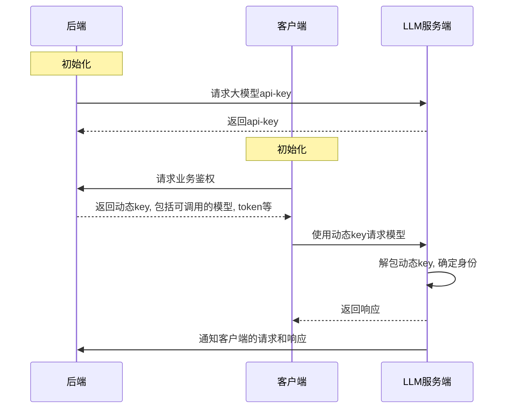

## 为什么要有这个项目

试想一下，在未来 llm agent 在端侧全面铺开，但是目前调用大模型的方式通过了是一个拿到了就可以随便使用的 api-key？那用户岂不是从端侧的模型拿到了 api-key 就可以刷爆你的账单？！！！如果每个人的手机都跑着几个 agent,你还有一堆用户，那你服务器岂不是比被 ddos 了还惨，因为 ddos 是不让你提供服务，而这种情况下相当于正常业务还在运行而你被打爆了！

所以，我们提出了[缄密 Dynaseal](https://github.com/IntelliKernel/Dynaseal)，一个面向未来端侧 agent 模型调用的服务端框架，通过一个类似于 oss 的动态 token,限制端侧 agent 可调用的模型和参数以及 token 存活时间，支持端侧直接和大模型服务商通信并在响应结束后通过回调告知你的业务后端。欢迎各位大佬批评指正 star。

> 请注意，本项目只是一个 demo,实现了我们对于动态分发 api key 从端侧请求大模型相应的设计，大模型部分被设计成一个 openai api 格式的大模型服务器的 warper。对于端侧的请求，我们只做了简单的密钥完整性校验和参数校验。请求结束的回调只实现了在终端的打印。

## 系统设计

架构分为 llm 服务端，后端和客户端三部分。

1. 后端初始化，向 llm 服务端请求大模型 api-key
2. 客户端初始化，向后端业务鉴权接口请求，通过后后端返回动态 key, 指定模型，token, 请求地址和模型等基本信息。
3. 客户端使用动态 key 向大模型服务端请求模型
4. 大模型服务端解包动态 key,确定身份后生成并返回响应
5. 大模型服务端通过后端的回调通知后端客户端的请求和响应




## 动态 key 设计

动态 key 被设计为一个 jwt token，即`header.payload.secret`

- header
- payload:首先生成一个格式如下的 json，然后打包成 jwt payload

```json
{
  "api-key": 111, // 后端在llm服务端注册的用户的id,请注意，是id而非llm server给出的key
  "model": "deepseek-chat", // 端侧可调用的模型名
  "max_tokens": 100, // 最多可以调用的token数量
  "expiring": 111, // 过期时间，使用unix时间戳
  "event_id": 111 // 时间id,用于表示此token,llm服务端响应完请求会在调用中带上此enent_id
}
```

- secret:使用后端在 llm 服务端注册的用户请求出来的 key 加密，llm 服务端会使用这部分校验动态 key 是否合法

## 具体实现

### 文件夹说明

- llm-server 大模型后端，是我们常规使用中调用的服务器，在普通的 api 调用基础上加入了我们的设计-对动态 kay 进行鉴权并响应
- backend 业务后端，购买了大模型 api key 的公司/个人提供服务的后端，可以对端侧进行鉴权然后下分 dongtaikey
- client 端侧，是运行 agent 的地方

### 数据库创建

#### llm 服务端

在`User`表下面创建用户如下,该用户账号密码是`user1:user1`

```json
{
  "_id": {
    "$oid": "671249a93f1cf2f8bf9b2b82"
  },
  "api_keys": [
    {
      "_id": null,
      "revision_id": null,
      "api_key": "4d72c063-881f-45fa-85ab-3375c84f5dd7",
      "last_used": 0
    }
  ],
  "email": "user1@example.com",
  "password": "$2b$12$QFk6uHDBM5s69uSXrchivOC5SbpTUGV4tjmWz0nRvPSiMt.WAZVhC",
  "total_tokens": 0,
  "username": "user1",
  "callback_url": "http://127.0.0.1:9000/v1/callback/usage"
}
```

#### 业务后端

在`User`表下面创建用户如下,该用户账号密码是`client1:client1`

```json
{
  "_id": {
    "$oid": "671247fadb2faa4fec2c6f39"
  },
  "api_keys": [],
  "email": "client1@example.com",
  "password": "$2b$12$fWy.Yjs9x5zSRirRibjliO4GX66GSO/.GuG7he9lIatuiNDoPPb9a",
  "username": "client1"
}
```

### 环境变量

#### llm 服务端

```
SECRET_KEY //jwt密钥
ALGORITHM //jwt加密算法
ACCESS_TOKEN_EXPIRE_MINUTES //jwt access token过期时间
REFRESH_TOKEN_EXPIRE_MINUTES //jwt refersh token过期时间
MONGODB_URL // mongo数据库地址
MONGODB_DB // mongo数据库名
ADMIN_USER_PASSWORD // 管理员密码
OPENAI_BASE_URL // warp的openai base url
OPENAI_API_KEY // warp的openai api key
```

#### 业务后端

LLM_USER_ID 是业务后端在 llm 服务端注册的用户的 id，LLM_KEY 是业务后端在 llm 服务端注册的用户申请到的密钥

```
SECRET_KEY //jwt密钥
ALGORITHM //jwt加密算法
ACCESS_TOKEN_EXPIRE_MINUTES //jwt access token过期时间
REFRESH_TOKEN_EXPIRE_MINUTES //jwt refersh token过期时间
MONGODB_URL // mongo数据库地址
MONGODB_DB // mongo数据库名
ADMIN_USER_PASSWORD // 管理员密码
LLM_KEY = "4d72c063-881f-45fa-85ab-3375c84f5dd7"
LLM_USER_ID = "671249a93f1cf2f8bf9b2b82"
```

### 接口约定

- `llm_server_url`: http://127.0.0.1:8000
- `backend_url`: http://127.0.0.1:9000

- `backend_url/user/login`: 用户登陆
  - data
    - username
    - password
  - response
    - access_token: 后续和业务后端交互需要带上此 token
    - refresh_token：用于刷新 access token
    - token_type
- `backend/key/create`: 生成动态 key

  - header
    - bearer
  - response
    - token: 动态 key，和 llm 服务端交互作为 Authorization 请求头

- `llm_server_url/chat/completions`: 请求大模型，这个请求会校验端侧的请求，对于不合适的请求会抛出错误
  - header
    - Authorization
  - body
    同 openai 格式
  - response
    同 openai 格式
- `backend_url/callback/usage`: 回调接口，在 llm 服务端响应端侧请求结束后，llm 服务端会发送请求告知业务后端该次请求的内容和 token 数量
  - event_id：动态 key 的 event_id
  - content: 大模型相应的内容
  - tokens: 大模型消耗的 token 数量

## 启动项目

1. 启动 llm server

```
cd llm-server
python main.py
```

2. 启动业务后端 backend

```
cd backend
python main.py
```

3. 运行 client,查看是否调用成功

```
cd client
python request_side.py
```

运行成功后 client 的终端可以流式输出，backend 的终端打印出`evnet_id`,`content`和`tokens`

client 终端


backend 终端


## 未实现

- [ ] 回调请求存入数据库
- [ ] llm server 注册和 backend 注册
- [ ] ……
