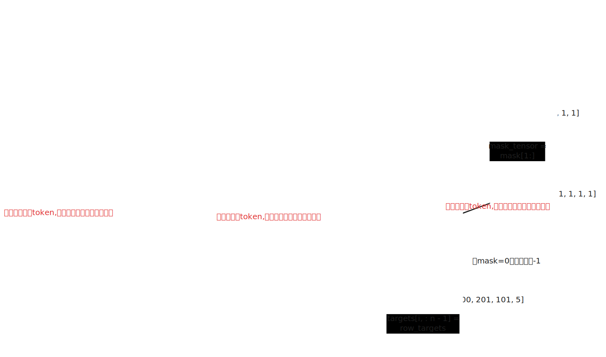

## 数据构造



原始对话数据

```json
conversation = {
	"messages": [
		{"role": "user", "content": "你好"},
		{"role": "assistant", "content": "我很好"}
	]
}
```

`tokenizer.render_conversation(doc)` 的输出

```
# 特殊token
<|bos|> = 1
<|user_start|> = 2
<|user_end|> = 3
<|assistant_start|> = 4
<|assistant_end|> = 5

# 文本token
"你" = 100
"好" = 101
"我" = 200

"很" = 201
"好" = 101
```

渲染逻辑（来自tokenizer.py）

```python
# 1. BOS token (mask=0)

add_tokens(1, 0)

# 2. User消息 (全部mask=0，不参与loss计算)
add_tokens(2, 0) # <|user_start|>
add_tokens([100, 101], 0) # "你好"
add_tokens(3, 0) # <|user_end|>

# 3. Assistant消息
add_tokens(4, 0) # <|assistant_start|> mask=0
add_tokens([200, 201, 101], 1) # "我很好" mask=1 (参与loss)
add_tokens(5, 1) # <|assistant_end|> mask=1 (参与loss)
```

生成的ids和mask

```python
ids =  [1, 2, 100, 101, 3, 4, 200, 201, 101, 5]
mask = [0, 0, 0, 0, 0, 0, 1, 1, 1, 1]
		BOS u_s 你 好 u_e a_s 我 很 好 a_e

```

collate_and_yield 处理

```python

n = 10 # len(ids)

ids_tensor = torch.tensor([1, 2, 100, 101, 3, 4, 200, 201, 101, 5])

# 构造inputs (去掉最后一个token,最后一个没有下一个可预测) - Next Token Prediction
inputs = ids_tensor[:-1]
# inputs = [1, 2, 100, 101, 3, 4, 200, 201, 101]

# 构造row_targets (去掉第一个token,第一个不能作为预测的目标)
row_targets = ids_tensor[1:]
# row_targets = [2, 100, 101, 3, 4, 200, 201, 101, 5]

# 提取对应的mask (去掉第一个mask值，因为BOS永远不是target)
mask_tensor = mask[1:]
# mask_tensor = [0, 0, 0, 0, 0, 1, 1, 1, 1]

# 应用mask：将mask=0的位置设为-1 (ignore_index)
row_targets[mask_tensor == 0] = -1
# row_targets = [-1, -1, -1, -1, -1, 200, 201, 101, 5]
```

那`row_targets[mask_tensor == 0] = -1` 的意义是什么呢？在计算loss的时候，只在assistant tokens计算loss

最终batch数据（假设batch_size=1）

```python

inputs = torch.tensor([[1, 2, 100, 101, 3, 4, 200, 201, 101]])
# 形状: (1, 9)

targets = torch.tensor([[-1, -1, -1, -1, -1, 200, 201, 101, 5]])
# 形状: (1, 9)

```

位置对应关系与训练监督

```

位置 input → target 训练？

0 1 (BOS) → -1 ✗ 忽略，BOS后的user_start不监督
1 2 (u_s) → -1 ✗ 忽略，用户消息开始标记
2 100 (你) → -1 ✗ 忽略，用户输入不监督
3 101 (好) → -1 ✗ 忽略，用户输入不监督
4 3 (u_e) → -1 ✗ 忽略，用户消息结束标记
5 4 (a_s) → 200 (我) ✓ 计算loss，学习生成"我"
6 200 (我) → 201 (很) ✓ 计算loss，学习生成"很"
7 201 (很) → 101 (好) ✓ 计算loss，学习生成"好"
8 101 (好) → 5 (a_e) ✓ 计算loss，学习生成结束标记
```

模型在看到`<|assistant_end|>`则结束输出，也就是说，模型在SFT阶段才真的学会怎么停止说话，在pre-train只是无情的吐词机器

## 实践经验

### LR Warmup的完全移除 + 线性衰减

```python
def get_lr_multiplier(it):
    lrm = 1.0 - it / num_iterations  # ← 直接线性衰减到0
    return lrm
```

- SFT数据量小（23K rows），warmup不必要
- **简单线性衰减** = 训练稳定性更好
- Base model已经稳定收敛，不需要复杂的LR schedule
