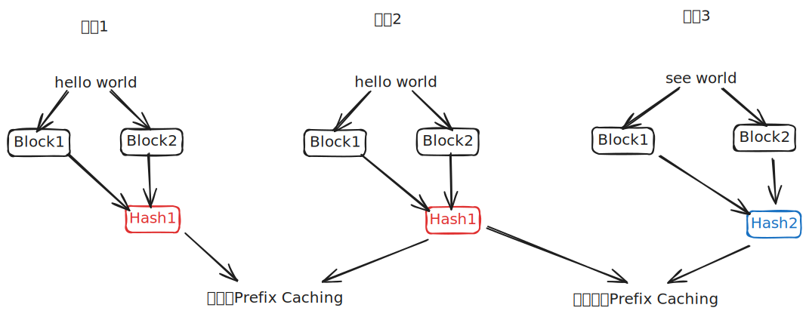

## Block

先看物理块管理器,一个`Block`类比就是操作系统中的页表项

```python
class Block:

    def __init__(self, block_id):
        self.block_id = block_id
        self.ref_count = 0
        self.hash = -1
        self.token_ids = []

    def update(self, hash: int, token_ids: list[int]):
        self.hash = hash
        self.token_ids = token_ids

    def reset(self):
        self.ref_count = 1
        self.hash = -1
        self.token_ids = []
```

- `block_id: int` : 在 KV Cache Tensor 中的索引位置
- `ref_count: int` : 有多少个序列在用这个块（引用计数）
- `hash: int` : 这个块存储内容的哈希值（用于 Prefix Caching）
- `token_ids: list[int]` : 缓存的 token 内容（仅用于验证，不是真正的 KV）

`update`和`reset` 一个是分配/更新一个是释放

## BlockManager

下面的`BlockManager` 就是页表管理器了

- `block_size: int` : 页大小（256 tokens）
- `blocks: list[Block]` : 页表（所有页表项），维护每个物理块的状态
- `hash_to_block_id: dict` : 内容索引（用于 Prefix Caching）, 类似文件系统的 inode 缓存,实现 Prefix Caching
- `free_block_ids: deque` : 空闲页链表，快速分配新块，新请求来时，直接从队首取 `free_block_ids[0]`
- `used_block_ids: set` : 已分配页集合,快速判断块是否已分配

### 链式哈希

链式哈希 是一种用于 KV Cache（键值缓存）管理 的机制，主要用于实现 Prefix Caching（前缀缓存。它的核心逻辑是：**一个 Block 的哈希值不仅取决于它内部的 Token，还取决于它前一个 Block 的哈希值。**

==换言之，对两个内容相同的块，我只需要看一下这两个链式哈希的是否一样就知道这个序列前面的内容是否也一样==，这对我们判断能否复用Prefix Caching帮助很大



```python
def compute_hash(cls, token_ids: list[int], prefix: int = -1):
    h = xxhash.xxh64()

    # 关键点：如果有前缀（即前一个 Block 的哈希），先把它 update 进去
    if prefix != -1:
        h.update(prefix.to_bytes(8, "little"))

    # 然后再 update 当前 Block 的 token
    h.update(np.array(token_ids).tobytes())
    return h.intdigest()

```

在分配时的链式传递

```python
h = -1
for i in range(seq.num_blocks):
    token_ids = seq.block(i)
    # 上一轮循环计算出的 h，被当作这一轮的 prefix 传入
    h = (
        self.compute_hash(token_ids, h)
        if len(token_ids) == self.block_size
        else -1
    )
```

### 分配和释放

`_allocate_block` 和 `_deallocate_block` 是分配和释放一个显存块的基本功能，`can_allocate`用于判断显存块还够不够用

`allocate` 就是具体分配的函数了，先遍历序列，给每个块分配一个显存块并且计算出他们的链式存储。接下来根据他的链式哈希值去找是否有可复用的块，根据没有或内容不匹配判断是否命中 - 未命中，分配新块 - 命中，分配新块

```python
def allocate(self, seq: Sequence):
    assert not seq.block_table
    h = -1
    cache_miss = False
    for i in range(seq.num_blocks):
        token_ids = seq.block(i)
        h = (
            self.compute_hash(token_ids, h)
            if len(token_ids) == self.block_size
            else -1
        )
        block_id = self.hash_to_block_id.get(h, -1)
        if block_id == -1 or self.blocks[block_id].token_ids != token_ids:
            cache_miss = True
        if cache_miss:
            block_id = self.free_block_ids[0]
            block = self._allocate_block(block_id)
        else:
            seq.num_cached_tokens += self.block_size
            if block_id in self.used_block_ids:
                block = self.blocks[block_id]
                block.ref_count += 1
            else:
                block = self._allocate_block(block_id)
        if h != -1:
            block.update(h, token_ids)
            self.hash_to_block_id[h] = block_id
        seq.block_table.append(bl
```

> 这里有个问题啊，命中了缓存时，有个判断是在不在`used_block_ids`？不在的话还要分配。这是因为`deallocate`没释放过`hash_to_block_id`，也就是说`hash_to_block_id`永久保存，但块本身可能被释放回收了，所以分配的时候要处理。

`deallocate`是释放块的逻辑，没什么好说的

```python
def deallocate(self, seq: Sequence):
    for block_id in reversed(seq.block_table):
        block = self.blocks[block_id]
        block.ref_count -= 1
        if block.ref_count == 0:
            self._deallocate_block(block_id)
    seq.num_cached_tokens = 0
    seq.block_table.clear()
```

还有两个在`decode`阶段做的

`can_append`判断能否为序列追加新的token（在decode阶段每生成一个token后调用）

`may_append`在块满或新块做必要的操作，其他时间静默
