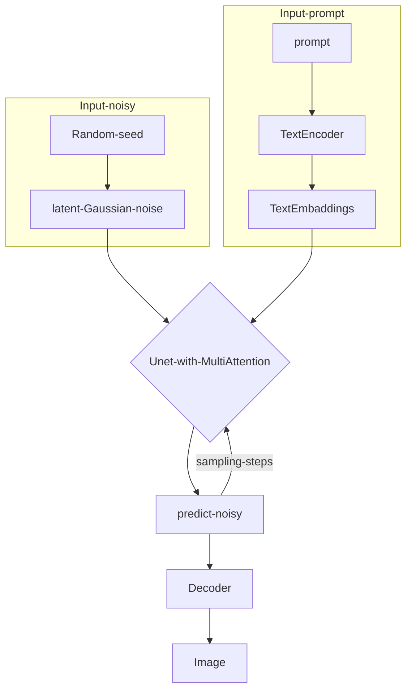

Stable Diffusion 是一个图像生成方法，由 _[Stability AI](https://stability.ai/) and [Runway](https://runwayml.com/)_ 在LDM[^1] 的基础上提出。在GitHub有很多他的实现和应用[^2][^3][^4] ,其中[^2] 是最早的实现版本，[^3] 是V2版本，由 Stability AI 完成。

## 整体结构

在一开始，StableDiffusion会通过一个随机数种子生成一张在隐空间下的随机噪声，同时通过一个文本编码器对输入的prompt进行编码，生成一个文本向量。随机噪声和文本向量会一块送入Unet，经过DDPM的步骤得到一张隐空间下的图片，通过一个解码器得到完整的图片。这里的Unet做出了改进，中间加入了交叉注意力机制。

### Unet-with-MultiAttention 

图中Switch用于在不同的输入之间调整。

- 文本数据通过一个文本编码器(一般是CLIP的文本编码器)将文本转换为向量，投影到Unet上
- 图像，语义图，表示等直接送入Unet

反向扩散过程中输入的文本向量和隐空间下的噪声图片需要经过 $t$轮的Unet网络，每一轮预测一个噪声，噪声图减去这个噪声，得到的图片继续送入Unet进行下一轮

## 参考文献
[^1]: Rombach, R., Blattmann, A., Lorenz, D., Esser, P., & Ommer, B. (2022). High-Resolution Image Synthesis with Latent Diffusion Models. 2022 IEEE/CVF Conference on Computer Vision and Pattern Recognition (CVPR). Presented at the 2022 IEEE/CVF Conference on Computer Vision and Pattern Recognition (CVPR), New Orleans, LA, USA. https://doi.org/10.1109/cvpr52688.2022.01042
[^2]: CompVis. (n.d.). _GitHub - CompVis/stable-diffusion: A latent text-to-image diffusion model_. GitHub. Retrieved May 29, 2023, from https://github.com/CompVis/stable-diffusion
[^3]: Stability-AI. (n.d.). _GitHub - Stability-AI/stablediffusion: High-Resolution image synthesis with latent diffusion models_. GitHub. Retrieved May 29, 2023, from https://github.com/Stability-AI/stablediffusion
[^4]:  AUTOMATIC1111. (n.d.). _GitHub - AUTOMATIC1111/stable-diffusion-webui: Stable Diffusion web UI_. GitHub. Retrieved May 29, 2023, from https://github.com/automatic1111/stable-diffusion-webui
[^5]: Steins. (2023, January 2). Stable diffusion clearly explained! - Steins. _Medium_. https://medium.com/@steinsfu/stable-diffusion-clearly-explained-ed008044e07e