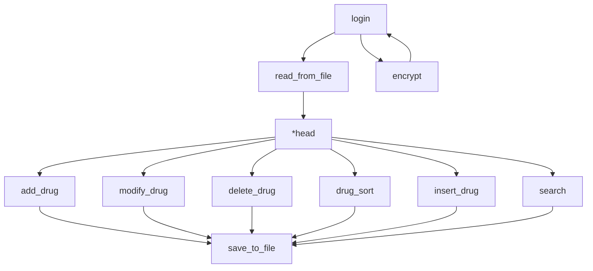
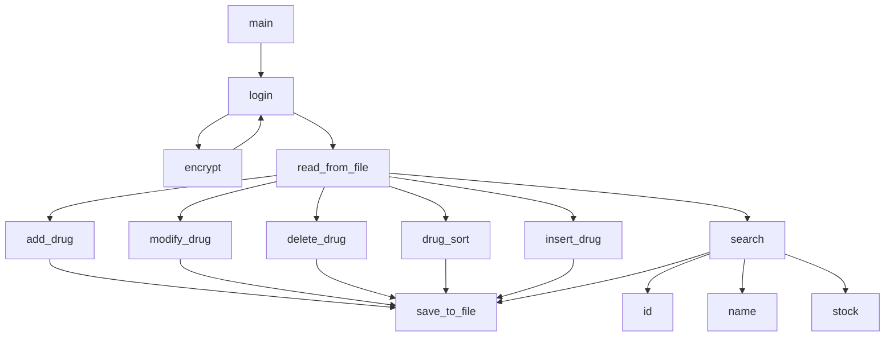
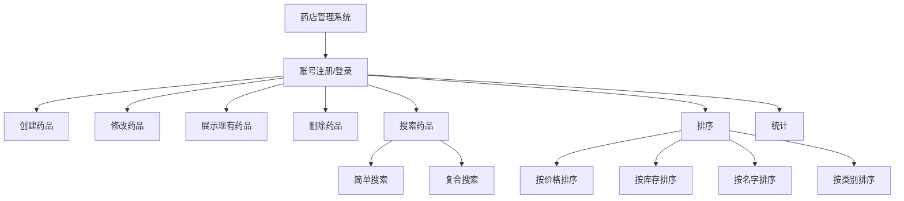
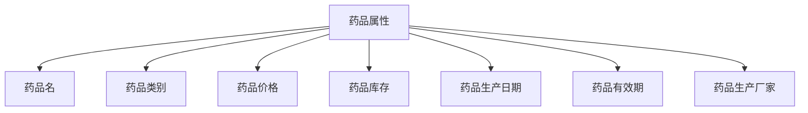

# 从0开始写c语言课设
## 项目简述
管理系统是C语言课设的经典项目，但是在chatGPT已经兴起的今天依然有不少同学因课设而困扰，本文将从0开始写一个简单的药店管理系统。

项目开源于 [GitHub](https://github.com/StudyingLover/c_curriculum_design)





## 开发环境
- 操作系统：Windows 10
- CMake：3.10
- GCC：mingw32 6.3
- IDE：Clion

## 项目结构
```
.
├── main.c
├── CMakeLists.txt
├── README.md
├── .gitignore
├── include
│   ├── main.h
│   └── actions
│       ├── add.h
│       ├── delete.h
│       ├── sort.h
│       ├── modify.h
│       ├── search.h
│       ├── insert.h
│       ├── search.h
│   └── date
│       ├── date.h
│   └── log
│       ├── log.h
│   └── user
│       ├── user.h   
├── src
│   ├── actions
│       ├── add.c
│       ├── delete.c
│       ├── sort.c
│       ├── modify.c
│       ├── search.c
│       ├── insert.c
│       ├── search.c
│   └── date
│       ├── date.c
│   └── log
│       ├── log.c
│   └── user
│       ├── user.c   
├── build
├── config
│   ├── drugs.txt
├── cmake-build-debug
```

## 项目设计
### 功能简介

### 药品属性


   
### 时间计划


## 实现功能
我的博客mermaid支持存在一些问题，所以链表操作的示意图后面会补上
### main.h
通过一个结构体定义了药品信息，包括药品id、药品名称、药品类型、药品价格、药品库存、生产日期、保质期、生产厂家等信息。生产日期格式为`yyyy-mm-dd`
``` c
#ifndef C_CURRICULUM_DESIGN_MAIN_H
#define C_CURRICULUM_DESIGN_MAIN_H
struct drug {
    int id;
    char name[50];
    char type[50];
    float price;
    int stock;
    char production_date[50];  // 生产日期
    char expiration_date[50];  // 保质期
    char manufacturer[50];  // 生产厂家
};
struct node {
    struct drug data;
    struct node *next;
};
#endif //C_CURRICULUM_DESIGN_MAIN_H
```

### 登录
登陆部分复用了大二同学的一个项目，方法是写死一个管理员账号和密码，然后输入账号密码进行验证，验证成功后进入主菜单，否则重新输入，有三次输入机会。

- user.h
```c
#ifndef C_CURRICULUM_DESIGN_USER_H
#define C_CURRICULUM_DESIGN_USER_H
int login();
#endif //C_CURRICULUM_DESIGN_USER_H
```
- user.c
```c
int login()
{
    int n, i;
    char pass[15] = "abc123", ch[15] = "12345678";
    printf("please enter the correct username and password: (you have three chances to enter) \n//username: 12345678; correct password: abc123");
    for (i = 0; i < 3; i++)
    {
        char pass1[15], ch1[15];
        printf("**************************************************\n");
        printf("--------------------------------------------------\n");
        printf("\t\t\tlogin\n");
        printf("--------------------------------------------------\n");
        printf("account:\n");
        gets(ch1);
        printf("--------------------------------------------------\n");
        printf("password:\n");
        gets(pass1);
        printf("--------------------------------------------------\n");
        printf("**************************************************\n\n\n");

        if (strcmp(ch, ch1) == 0 && strcmp(pass, pass1) == 0)
        { // 两字符串相等时为0
            printf("password correct\n");
            system("cls");

            return 0;
        }
        else
        {
            printf("wrong,please try again");
            printf("you only have %d chance(s) to try", 3 - i - 1);
            if (3 - 1 - i == 0)
            {
                return 1;
            }
        }
        system("cls");
    }
}
```

### 文件读取与保存

这里的功能是直接定义在`main.c`文件中的

- main.c
```c
char config_path[100] = "../config/drugs.txt";//文件路径,../是因为main.c和config文件夹在同一目录下，但是编译后的可执行文件在build文件夹下，所以需要返回上一级目录

struct node *read_from_file()
{
    FILE *fp = fopen(config_path, "r+");
    if (fp == NULL)
    {
        printf("Error: Cannot open file.\n");
        exit(1);
    }

    struct node *head = NULL;
    struct node *tail = NULL;

    char line[100];
    while (fgets(line, 100, fp) != NULL)
    {
        printf("len:%d  ,  %s",strlen(line),line);
        struct drug new_drug;
        if(strlen(line) == 1)
            continue;
        sscanf(line, "%d,%[^,],%[^,],%f,%d,%[^,],%[^,],%[^,]", &new_drug.id, new_drug.name,
               new_drug.type, &new_drug.price, &new_drug.stock, new_drug.production_date, new_drug.expiration_date, new_drug.manufacturer);
        struct node *new_node = (struct node *)malloc(sizeof(struct node));
        new_node->data = new_drug;
        new_node->next = NULL;

        if (head == NULL)
        {
            head = new_node;
            tail = new_node;
        }
        else
        {
            tail->next = new_node;
            tail = new_node;
        }
    }

    fclose(fp);
    return head;
}

void save_to_file(struct node *head)
{
    FILE *fp = fopen(config_path, "w+");
    if (fp == NULL)
    {
        printf("Error: Cannot open file.\n");
        exit(1);
    }

    struct node *current = head;
    while (current != NULL)
    {
        fprintf(fp, "%d,%s,%s,%.2f,%d,%s,%s,%s\n", current->data.id, current->data.name,
                current->data.type, current->data.price, current->data.stock, current->data.production_date, current->data.expiration_date, current->data.manufacturer);
        current = current->next;
    }

    fclose(fp);
}

```

### 添加药品

这里分两种情况讨论
1. 头节点为空，直接添加
2. 头节点不为空，遍历链表，找到最后一个节点，然后添加

- add.c
```c
#include <stdio.h>
#include <stdlib.h>
#include <string.h>
#include "main.h"
#include "date/date.h"
void add_drug(struct node **head) {
    struct drug new_drug;

    printf("Enter drug ID: ");
    scanf("%d", &new_drug.id);

    printf("Enter drug name: ");
    scanf("%s", new_drug.name);

    printf("Enter drug type: \n");
    printf("1 means prescription drugs , and 2 means OTC(over-the-counter drugs)");
    scanf("%s", new_drug.type);

    printf("Enter drug price: ");
    scanf("%f", &new_drug.price);

    printf("Enter drug stock: ");
    scanf("%d", &new_drug.stock);

    printf("Enter drug production date: \n");
    printf("the format of date is YYYY-MM-DD ,for example ,2022-03-02");
    scanf("%s", new_drug.production_date);

    printf("Enter drug expiration date(days): ");
    scanf("%s", new_drug.expiration_date);

    printf("Enter drug manufacturer: ");
    scanf("%s", new_drug.manufacturer);

    struct node *new_node = (struct node*)malloc(sizeof(struct node));
    new_node->data = new_drug;
    new_node->next = NULL;

    if (*head == NULL) {
        *head = new_node;
    } else {
        struct node *current = *head;
        while (current->next != NULL) {
            current = current->next;
        }
        current->next = new_node;
    }
}
```
- add.h
```c
#ifndef C_CURRICULUM_DESIGN_ADD_H
#define C_CURRICULUM_DESIGN_ADD_H
void add_drug(struct node **head);
#endif //C_CURRICULUM_DESIGN_ADD_H
```

### 删除药品

- delete.h
```c
#ifndef C_CURRICULUM_DESIGN_DELETE_H
#define C_CURRICULUM_DESIGN_DELETE_H
void delete_drug(struct node **head, int id);
#endif //C_CURRICULUM_DESIGN_DELETE_H
```

- delete.c
```c
#include <stdio.h>
#include <stdlib.h>
#include <string.h>
#include "main.h"
void delete_drug(struct node **head, int id) {
    struct node *current = *head;
    struct node *previous = NULL;

    while (current != NULL) {
        if (current->data.id == id) {
            if (previous == NULL) {
                *head = current->next;
            } else {
                previous->next = current->next;
            }

            free(current);
            printf("Drug with ID %d has been deleted.\n", id);
            return;
        }

        previous = current;
        current = current->next;
    }

    printf("Error: Drug with ID %d not found.\n", id);
}
```


### 修改药品
- modify.c
```c
#include <stdio.h>
#include <stdlib.h>
#include <string.h>
#include "main.h"
void modify_drug(struct node *head) {
    int id;
    printf("Enter the ID of the drug you want to modify: ");
    scanf("%d", &id);

    struct node *current = head;
    while (current != NULL) {
        if (current->data.id == id) {
            printf("Enter the new name of the drug: ");
            scanf("%s", current->data.name);

            printf("Enter the new type of the drug: \n");
            printf("1 means prescription drugs , and 2 means OTC(over-the-counter drugs)");
            scanf("%s", current->data.type);

            printf("Enter the new price of the drug: ");
            scanf("%f", &current->data.price);
            printf("Enter the new stock of the drug: ");
            scanf("%d", &current->data.stock);

            printf("Enter the new production date of the drug: \n");
            printf("the format of date is YYYY-MM-DD ,for example ,2022-03-02");
            scanf("%s", current->data.production_date);

            printf("Enter the new expiration date of the drug(days): ");
            scanf("%s", current->data.expiration_date);

            printf("Enter the new manufacturer of the drug: ");
            scanf("%s", current->data.manufacturer);

            printf("Drug with ID %d has been modified.\n", id);
            return;
        }
        current = current->next;
    }

    printf("Error: Drug with ID %d not found.\n", id);
}
```
- modify.h
```c
#ifndef C_CURRICULUM_DESIGN_MODIFY_H
#define C_CURRICULUM_DESIGN_MODIFY_H
void modify_drug(struct node *head);
#endif //C_CURRICULUM_DESIGN_MODIFY_H
```

### 查询药品
查询部分采用了及其暴力的方法，给每个要查询的属性写一个函数，然后遍历链表，将所有符合条件的药品都打印出来。

- search.h

```c
#ifndef C_CURRICULUM_DESIGN_SEARCH_H
#define C_CURRICULUM_DESIGN_SEARCH_H
#include "../main.h"
void search_by_id(struct node *head, int id);
void search_by_name(struct node *head, char *name);
void search(struct node *head);
#endif //C_CURRICULUM_DESIGN_SEARCH_H
```

- search.c
```c
#include <stdio.h>
#include <stdlib.h>
#include <string.h>
#include "main.h"
#include "log/log.h"
void search_by_id(struct node *head, int id) {
    struct node *current = head;
    int found = 0;

    while (current != NULL) {
        if (current->data.id == id) {
            print_drug(current->data);
            found = 1;
        }

        current = current->next;
    }

    if (!found) {
        printf("No drug with ID %d found.\n", id);
    }
}

void search_by_name(struct node *head, char *name) {
    struct node *current = head;
    int found = 0;

    while (current != NULL) {
        if (strcmp(current->data.name, name) == 0) {
            print_drug(current->data);
            found = 1;
        }

        current = current->next;
    }

    if (!found) {
        printf("No drug with name \"%s\" found.\n", name);
    }
}

void search(struct node *head) {
    int choice, id;
    char name[50];

    printf("Choose a search criteria:\n");
    printf("1. ID\n");
    printf("2. Name\n");
    printf("Enter your choice: ");
    scanf("%d", &choice);

    switch (choice) {
        case 1:
            printf("Enter the ID of the drug to search: ");
            scanf("%d", &id);
            search_by_id(head, id);
            break;

        case 2:
            printf("Enter the name of the drug to search: ");
            scanf("%s", name);
            search_by_name(head, name);
            break;

        default:
            printf("Invalid choice. Please try again.\n");
            break;
    }
}
```

### 插入药品
这是一个我也不知道为什么要写的功能，但是我还是写了，就是在链表中插入一个药品，插入的位置是按照ID来搜索的。
- insert.h
```c
#ifndef C_CURRICULUM_DESIGN_INSERT_H
#define C_CURRICULUM_DESIGN_INSERT_H
void insert_drug(struct node **head, int last_id);
#endif //C_CURRICULUM_DESIGN_INSERT_H
```

- insert.c
```c
#include <stdio.h>
#include <stdlib.h>
#include <string.h>
#include "main.h"

void insert_drug(struct node **head , int last_id)
{
    struct drug new_drug;

    printf("Enter drug ID: ");
    scanf("%d", &new_drug.id);

    printf("Enter drug name: ");
    scanf("%s", new_drug.name);

    printf("Enter drug type: \n");
    printf("1 means prescription drugs , and 2 means OTC(over-the-counter drugs)");
    scanf("%s", new_drug.type);

    printf("Enter drug price: ");
    scanf("%f", &new_drug.price);

    printf("Enter drug stock: ");
    scanf("%d", &new_drug.stock);

    printf("Enter drug production date: \n");
    printf("the format of date is YYYY-MM-DD ,for example ,2022-03-02");
    scanf("%s", new_drug.production_date);

    printf("Enter drug expiration date: ");
    scanf("%s", new_drug.expiration_date);

    printf("Enter drug manufacturer: ");
    scanf("%s", new_drug.manufacturer);

    struct node *new_node = (struct node *)malloc(sizeof(struct node));
    new_node->data = new_drug;
    new_node->next = NULL;

    if (*head == NULL)
    {
        *head = new_node;
    }
    else
    {
        //将新节点插入到last_id所在的位置之后
        struct node *current = *head;
        while (current->data.id != last_id)
        {
            current = current->next;
        }
        new_node->next = current->next;
        current->next = new_node;
    }
}
```
### 统计药品
统计药品的功能是统计出当前库存中的药品的总数，总价值。
- count.h
```c
#ifndef C_CURRICULUM_DESIGN_COUNT_H
#define C_CURRICULUM_DESIGN_COUNT_H
#include "../main.h"
int countMedicine(struct node * head);
float countTotalValue(struct node* head);
#endif //C_CURRICULUM_DESIGN_COUNT_H

```
- count.c
```c
#include <stdio.h>
#include <stdlib.h>
#include <string.h>
#include "main.h"

int countMedicine(struct node* head) {
    int count = 0;
    struct node* p = head;
    while (p != NULL) {
        count++;
        p = p->next;
    }
    return count;
}
float countTotalValue(struct node* head) {
    float totalValue = 0.0;
    struct node* p = head;
    while (p != NULL) {
        totalValue += (p->data.price * p->data.stock);
        p = p->next;
    }
    return totalValue;
}
```

### 单个节点输出

这个函数是为了方便输出单个节点的数据，因为在输出链表的时候，每个节点都要输出，所以我就把这个函数单独拿出来了。

请注意，这个函数式在log文件夹下面的
- log.h
```c
#ifndef C_CURRICULUM_DESIGN_LOG_H
#define C_CURRICULUM_DESIGN_LOG_H
#include <stdio.h>
#include <stdlib.h>
#include <string.h>
#include "../main.h"
void print_drug(struct drug d);
#endif //C_CURRICULUM_DESIGN_LOG_H
```

- log.c
```c
#include <stdio.h>
#include <stdlib.h>
#include <string.h>
#include "main.h"
void print_drug(struct drug d) {
//    printf("%-10d%-20s%-10d\n", d.id, d.name, d.stock);
    printf("ID: %d, Name: %s, Type: %s, Price: %.2f, Stock: %d, Production Date: %s, Expiration Date: %s, Manufacturer: %s\n", d.id, d.name, d.type, d.price, d.stock, d.production_date, d.expiration_date, d.manufacturer);
}
```

### 日期处理
这个函数是为了处理日期，因为我在输入药品的时候，日期是以字符串的形式输入的，所以我就写了这个函数，把字符串转换成日期。

这个功能因为跨平台的问题，可能不能很好的运行。此外，在Linux下可以使用`strptime()`这个函数来做日期的转换，但是在Windows下没有这个函数。

- date.h
```c
#ifndef C_CURRICULUM_DESIGN_DATE_H
#define C_CURRICULUM_DESIGN_DATE_H
char* getOverDate(char* productionDate, char shelfLife_str);
#endif //C_CURRICULUM_DESIGN_DATE_H
```
- date.c
```c
#include <stdio.h>
#include <stdlib.h>
#include <string.h>
//#include <time.h>

// On Windows platform, the function strptime() from time.h is not supported, I found.

char* getOverDate(char* productionDate, char* shelfLife_str) {
    char* temp= shelfLife_str;
    int shelfLife = atoi(temp);
    // 将生产日期字符串按照 "-" 分割为年、月、日三个字符串
    char* year = strtok(productionDate, "-");
    char* month = strtok(NULL, "-");
    char* day = strtok(NULL, "-");

    // 将年、月、日字符串转换为整型变量
    int year_int = atoi(year);
    int month_int = atoi(month);
    int day_int = atoi(day);

    // 计算过期日期的年、月、日
    year_int += (shelfLife / 365);
    shelfLife %= 365;
    month_int += (shelfLife / 30);
    day_int += (shelfLife % 30);
    if (day_int > 30) {
        day_int -= 30;
        month_int++;
    }
    if (month_int > 12) {
        month_int -= 12;
        year_int++;
    }

    // 将过期日期的年、月、日转换为字符串
    char* expirationDate = (char*) malloc(sizeof(char) * 11);
    sprintf(expirationDate, "%04d-%02d-%02d", year_int, month_int, day_int);

    return expirationDate;
}
```

## 功能整合
将上面的功能整合起来，就是我们的主函数了。
```c
#include <stdio.h>
#include <stdlib.h>
#include <string.h>
#include "main.h"
#include "actions/count.h"
#include "actions/search.h"
#include "log/log.h"
#include "user/user.h"
#include "actions/add.h"
#include "actions/delete.h"
#include "actions/modify.h"
#include "actions/sort.h"
#include "actions/insert.h"

char config_path[100] = "../config/drugs.txt";

struct node *read_from_file()
{
    FILE *fp = fopen(config_path, "r+");
    if (fp == NULL)
    {
        printf("Error: Cannot open file.\n");
        exit(1);
    }

    struct node *head = NULL;
    struct node *tail = NULL;

    char line[100];
    while (fgets(line, 100, fp) != NULL)
    {
        struct drug new_drug;
        if(strlen(line) == 1)
            continue;
        sscanf(line, "%d,%[^,],%[^,],%f,%d,%[^,],%[^,],%[^,]", &new_drug.id, new_drug.name,
               new_drug.type, &new_drug.price, &new_drug.stock, new_drug.production_date, new_drug.expiration_date, new_drug.manufacturer);
        struct node *new_node = (struct node *)malloc(sizeof(struct node));
        new_node->data = new_drug;
        new_node->next = NULL;

        if (head == NULL)
        {
            head = new_node;
            tail = new_node;
        }
        else
        {
            tail->next = new_node;
            tail = new_node;
        }
    }

    fclose(fp);
    return head;
}

void save_to_file(struct node *head)
{
    FILE *fp = fopen(config_path, "w+");
    if (fp == NULL)
    {
        printf("Error: Cannot open file.\n");
        exit(1);
    }

    struct node *current = head;
    while (current != NULL)
    {
        fprintf(fp, "%d,%s,%s,%.2f,%d,%s,%s,%s\n", current->data.id, current->data.name,
                current->data.type, current->data.price, current->data.stock, current->data.production_date, current->data.expiration_date, current->data.manufacturer);
        current = current->next;
    }

    fclose(fp);
}

int main()
{
    int t;
    t = login();
    if (t == 1)
    {
        printf("you have entered the wrong password for three times, the program will exit.");
        return 0;
    }

    struct node *head = read_from_file();
    int option = -1;
    while (option != 0)
    {
        printf("Please select an option:\n");
        printf("1. Add a new drug\n");
        printf("2. Modify an existing drug\n");
        printf("3. Display drug list\n");
        printf("4. Delete a drug\n");
        printf("5. Search\n");
        printf("6. Sort\n");
        printf("7. Statistics\n");
        printf("8. insert\n");
        printf("0. Quit\n");

        scanf("%d", &option);

        if (option == 1)
        {
            add_drug(&head);
            int save_option = 0;
            printf("Save changes to file?\n");
            printf("1. Yes\n");
            printf("2. No\n");
            scanf("%d", &save_option);

            if (save_option == 1)
            {
                save_to_file(head);
            }
        }
        else if (option == 2)
        {
            modify_drug(head);
            int save_option = 0;
            printf("Save changes to file?\n");
            printf("1. Yes\n");
            printf("2. No\n");
            scanf("%d", &save_option);

            if (save_option == 1)
            {
                save_to_file(head);
            }
        }
        else if (option == 3)
        {
            struct node *current = head;
            while (current != NULL)
            {
                print_drug(current->data);
                printf("\n");
                current = current->next;
            }
        }
        else if (option == 4)
        {
            int delete_id;
            scanf("%d", &delete_id);
            printf("%d\n", delete_id);
            delete_drug(&head, delete_id);
        }
        else if (option == 5)
        {
            int search_option = 0;
            printf("Choose a search criteria:\n");
            printf("1. Simple search\n");
            printf("2. Complex search\n");
            scanf("%d", &search_option);
            if (search_option == 1)
            {
                search(head);
            }
            else if (search_option == 2)
            {
                search_complex(head);
            }
            else
            {
                printf("Invalid option. Please try again.\n");
            }
        }
        else if (option == 6)
        {
            drug_sort(head);
        }
        else if (option == 7)
        {
            printf("total:%d\n", countMedicine(head));
            printf("total price:%.2f\n", countTotalValue(head));
        }
        else if (option == 8)
        {
            int insert_id;
            scanf("%d", &insert_id);
            insert_drug(&head, insert_id);
        }
        else if (option == 0)
        {
            printf("Bye!\n");
        }

        else
        {
            printf("Invalid option. Please try again.\n");
        }

    }

    save_to_file(head);

    return 0;
}

```


## 项目编译
### Windows
#### Clion/VScode/others
使用自带的cmake工具或插件进行编译

#### bash
```bash
mkdir build
cd ./build
cmake .. -G "MinGW Makefiles"
cmake --build .
```

### Linux/MacOS
```bash
mkdir build
cd ./build
cmake ..
make
```

### github actions
在`.github/workflows`文件夹下创建文件`build.yml`
```yml
name: Build on Ubuntu

on:
  push:
    branches:
      - master
  pull_request:
    branches:
      - master

jobs:
  build:
    runs-on: ubuntu-latest
    steps:
      - uses: actions/checkout@v2
        with:
          ref: master
      - name: Get CMake
        uses: symbitic/install-cmake@master
      - name: build
        run: |
          mkdir build
          cd ./build
          cmake ..
          make
```
然后上传到Github即可自动编译。如果你希望获取编译好的文件，可以在最后加上将编译好的文件push到master分支的操作。

## 感谢
**感谢JetBrains学生认证提供的Clion免费许可证**

**感谢GitHub学生认证提供的copilot**

**感谢openai的chatGPT**

